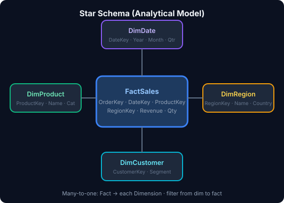

# Course diagrams & images

SVG architecture and concept diagrams used across lectures (crisp in light and dark mode).

| File | Topic | Suggested lectures |
|------|--------|--------------------|
| [crisp-dm-cycle.svg](crisp-dm-cycle.svg) | CRISP-DM lifecycle | L1, intro modules |
| [analytics-pipeline.svg](analytics-pipeline.svg) | End-to-end pipeline | L1, L4, L20 |
| [star-schema.svg](star-schema.svg) | Fact + dimensions | L22 |
| [missing-data-types.svg](missing-data-types.svg) | MCAR / MAR / MNAR | L5 |
| [powerbi-architecture.svg](powerbi-architecture.svg) | Power BI layers | L20–L24 |
| [ethics-pillars.svg](ethics-pillars.svg) | Fairness, privacy, transparency, accountability | L27, Capstone |

**Usage in HTML**
```html
<div class="diagram-box">
  
</div>
```
